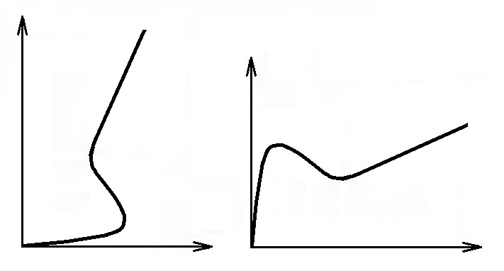
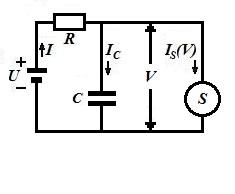
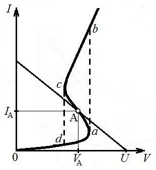

**4. Автоколебания**

4.1. Автоколебания в системах с одной степенью свободы. В предыдущих
разделах были рассмотрены свободные и вынужденные колебания в
диссипативных системах с одной степенью свободы, подчиняющихся
дифференциальным уравнениям второго порядка вида (2.5) и (2.45)
соответственно. Диссипация энергии, обусловленная наличием резистивных
элементов в этих системах, в первом случае приводила к затуханию
колебаний, а во втором -- компенсировалась энергией, поступающей от
внешнего источника синусоидального напряжения (или тока). Однако
колебания в системе с одной степенью свободы при определённых условиях
можно поддерживать, используя постоянный (не синусоидальный) источник
энергии, который периодически компенсирует потери колебательной энергии
по входящей в систему цепи обратной связи. Такие системы называются
**автоколебательными**, а протекающие в них процессы --
**автоколебаниями**. Форма и период автоколебаний определяются
свойствами самой системы, чем автоколебания существенно отличаются от
колебаний вынужденных.

Для определения условий возбуждения автоколебаний в диссипативной
системе с одной степенью свободы запишем уравнение (2.5) с учётом формул
(2.2), (2.3) в виде

$$\[\frac{dW}{dt}=-P(t),$$ {#eq:auto.1}

где $W={L{{I}^{2}}}/{2}\;+{{{q}^{2}}}/{2C}\;$-- энергия, запасённая в колебательном контуре, а $P(t)=R{{I}^{2}}(t)$-- мощность потерь. Интегрируя уравнение {@eq:auto.1} по периоду колебаний $T$, приходим к
равенству

$$W={{W}_{0}}-\int\limits_{0}^{T}{P(t)dt,$$ {#eq:auto.2}

где ${{W}_{0}}$-- энергия системы в некоторый момент времени, принятый за начало
отсчёта периода колебаний $T$. В обычной -- диссипативной -- системе $P(t)>0$, так
что автоколебания невозможны. Если же мощность потерь $P(t)=R{{I}^{2}}(t)$ в системе
[знакопеременна]{.underline}, то подбором режима работы системы можно
обеспечить энергетический баланс:

$$\int\limits_{0}^{T}{R{{I}^{2}}(t)dt}=0,$$ {#eq:auto.3}
и, следовательно, возбудить в системе автоколебания.

Выполнение условия {@eq:auto.3} возможно, например, в [нелинейной]{.underline}
колебательной системе, в которой сопротивление $R$ является функцией тока: $R=R(I)$,
причём -- [знакопеременной]{.underline}. Необходимым для
автоколебательного режима отрицательным «сопротивлением» ${dV}/{dI}$ на «падающих»
участках своих вольт-амперных характеристик $I(V)$, представленных на
рис. 11(а, б), обладают, например, газоразрядная лампа (а) и туннельный
диод (б). Обычно характеристики вида (а) называют *S*-образными, а вида
(б) -- *N*-образными.

а) б)

Рис.11. Вольт-амперные характеристики с «падающими» участками:

а) *S*-образным, б) *N*-образным

Форма автоколебаний зависит от добротности колебательного контура. При
большой добротности характер протекающих процессов почти не изменяется
по сравнению с тем, как они протекали бы в системе без поступления
энергии от источника: период и форма автоколебаний будут близки к
периоду и форме собственных колебаний. Это связано с тем, что в этом
случае от постоянного источника поступает энергия, составляющая малую
долю полной энергии колебательной системы. При малой добротности контура
(в общем случае -- колебательной системы) для поддержания колебаний от
постоянного источника должна поступать энергия, сопоставимая с энергией
колебаний. В этом случае форма автоколебаний может значительно
отличаться от синусоидальной. Наконец, в периодической системе, в
которой за период автоколебаний теряется вся накопленная энергия,
автоколебания становятся **релаксационными** и могут по форме очень
сильно отличаться от колебаний синусоидальных.

4.1. Автоколебания в вырожденных колебательных системах.
Автоколебательная система, не содержащая одного из накопителей
колебательной энергии, называется **вырожденной**. Колебания в такой
системе описываются дифференциальным уравнением первого порядка и,
очевидно, могут быть только релаксационными. В рассматриваемом здесь
случае электрических колебаний речь идёт об отсутствии в системе одного
из реактивных элементов: индуктивности или ёмкости.

В качестве примера рассмотрим представленную на рис. 12(а, б)
вырожденную колебательную систему, содержащую источник постоянного
напряжения *U*, ёмкость *C*, сопротивление *R* и нелинейный элемент с
*S*-образной вольт-амперной характеристикой ${{I}_{S}}(V)$. Как видно, в системе
отсутствует второй накопитель колебательной энергии -- индуктивность.

 

> а) Схема автоколебательной *RC*-системы б) Вольт-амперная
> характеристика и нагрузочная прямая

Рис. 12(а, б). Вырожденная автоколебательная система

Уравнения, описывающие поведение этой системы релаксационного типа,
имеют вид:

$$ RI+V=U,\]	\[I={{I}_{C}}+{{I}_{S}},\]	\[{{I}_{C}}=C\frac{dV}{dt},\]	\[{{I}_{S}}={{I}_{S}}\left( V \right). $$ {#eq:auto.4}

Следовательно,

$$ RC\frac{dV}{dt}=U-V-R{{I}_{S}}\left( V \right).$$ {#eq:auto.5}

В стационарном состоянии, когда , должно выполняться равенство

$$ {{I}_{S}}(V)={(U-V)}/{R} $$ {#eq:auto.6}

Правая часть здесь представляет **нагрузочную** прямую, точки
пересечения которой с вольт-амперной характеристикой ${{I}_{S}}\left( V \right)$ определяют
стационарные состояния системы. На рис.12б параметры $U$ и $R$ выбраны так,
чтобы стационарное состояние $A({{V}_{A}},{{I}_{A}})$ лежало на падающей ветви вольт-амперной
характеристики, где, как говорилось выше, возможен автоколебательный
режим. Покажем, что состояние ${{I}_{\text{}}}=I({{V}_{\text{}}})$ может быть [неустойчивым]{.underline}. Для
этого дадим малое приращение $v$ переменной $V$ в точке ${{V}_{A}}$ и представим в линейном
приближении по $v$ вольт-амперную характеристику $I(V)$ вблизи стационарного
состояния $V_A$:

$$ I(V)=I({{V}_{\text{}}}+v)\approx I\left( {{V}_{\text{A}}} \right)+{I}'\left( {{V}_{\text{A}}} \right)v, $$ {#eq:auto.7}

где «штрих» означает производную по *V*. Подстановка этого выражения в
{@eq:auto.5} приводит к уравнению

$$ RC\frac{dv}{dt}=-\left[ 1+R{I}'\left( {{V}_{\text{A}}} \right) \right]v, $$ {#eq:auto.8}

из которого следует, что при условии

$$ {I}'\left( {{V}_{\text{A}}} \right)<-{1}/{R}$$ {#eq:auto.9}

возмущение $v$ со временем экспоненциально нарастает, и, значит, стационарное состояние ${{I}_{\text{}}}=I({{V}_{\text{}}})$ является неустойчивым. Система при этом будет совершать [релаксационные автоколебания]{.underline}, замкнутая фазовая траектория которых на рис. 12б состоит из плавных участков *da* и *bc* вольт-амперной характеристики между напряжениями $V_1$ и $V_2$, соединённых двумя вертикальными участками *ab* и *cd*, показанными на рисунке штриховыми линиями. Формально вертикальные участки соответствуют [скачкам
тока]{.underline}, которые возможны только при отсутствии индуктивностей в системе, исходно заложенной в данной идеализированной модели. Учёт малой «паразитной» индуктивности элементов схемы, приводящей к появлению
э.д.с. индукции и, соответственно, к конечной скорости скачков, добавляет ещё одно дифференциальное уравнение первого порядка. Систему в целом теперь описывает дифференциальное уравнение второго порядка,
которое позволяет получить периодическое решение, представляющее автоколебательный процесс.
